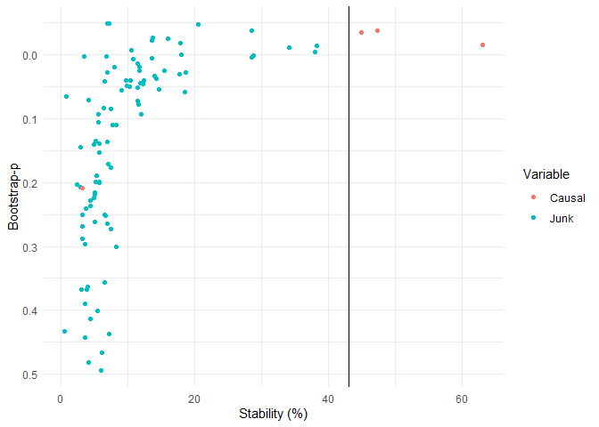

<!-- README.md is generated from README.Rmd. Please edit that file -->
<!-- badges: start -->
<!-- badges: end -->

# stabiliser

The goal of the package is to provide a flexible method of applying
stability selection (Meinshausen and Buhlmann, 2010) with various model
types, and the framework for triangulating the results for multiple
models (Lima et al., 2021).

-   `stabilise()` performs stability selection on a range of models to
    identify causal models.
-   `triangulate()` identifies which variables are most likely to be
    causal across all models.
-   `stab_plot()` allows visualisation of either `stabilise()` or
    `triangulate()` outputs.
-   `simulate_data()` allows the simulation of datasets to facilitate
    user the comparison of various statistical methods.

## Installation

You can install this package from github using the devtools package as
follows:

``` r
install.packages("stabiliser")
```

Or using the developmental version as follows:

``` r
devtools::install_github("roberthyde/stabiliser")
```

## Usage

The stabiliser_example is a simulated example dataset with 50
observations of the following variables:

-   1 simulated outcome variable: `y`
-   4 variables simulated to be associated with `y`: `causal1`,
    `causal2`…
-   95 variables simulated to have no association with `y`: `junk1`,
    `junk2`…

``` r
library(stabiliser)
data("stabiliser_example")
```

### `stabilise()`

To attempt to identify which variables are truly “causal” in this
dataset using a selection stability approach, use the `stabilise()`
function as follows:

``` r
stable_enet <- stabilise(data = stabiliser_example,
                         outcome = "y")
```

Access the stability (percentage of bootstrap resamples where a given
variable was selected by a given model) results for elastic net as
follows:

``` r
stable_enet$enet$stability
#> # A tibble: 100 x 7
#>    variable mean_coefficient ci_lower ci_upper bootstrap_p stability stable
#>    <chr>               <dbl>    <dbl>    <dbl>       <dbl>     <dbl> <chr> 
#>  1 causal1              2.58   0.207    5.45             0      90   *     
#>  2 causal3              2.59   0.222    6.49             0      78.5 *     
#>  3 causal2              2.12   0.0803   5.01             0      78   *     
#>  4 junk14               2.58   0.0695   7.31             0      71   <NA>  
#>  5 junk45               2.54   0.0526   5.76             0      63.5 <NA>  
#>  6 junk13               2.55   0.136    6.07             0      60.5 <NA>  
#>  7 junk88               1.88   0.0300   4.87             0      58   <NA>  
#>  8 junk86               1.59   0.110    4.98             0      57   <NA>  
#>  9 junk90               1.98   0.161    5.20             0      56   <NA>  
#> 10 junk65              -1.25  -3.65    -0.0244           0      46.5 <NA>  
#> # ... with 90 more rows
```

This ranks the variables by stability, and displays the mean
coefficients, 95% confidence interval and bootstrap p-value. It also
displays whether the variable is deemed “stable”, in this case 3 out of
the 4 truly causal variables are identified as “stable”, with no false
positives.

By default, this implements an elastic net algorithm over a number of
bootstrap resamples of the dataset (200 resamples for small datasets).
The stability of each variable is then calculated as the proportion of
bootstrap repeats where that variable is selected in the model.

`stabilise()` also permutes the outcome several times (10 by default for
small datasets) and performs the same process on each permuted dataset
(20 bootstrap resamples for each by default).

This allows a permutation threshold to be calculated. Variables with a
non-permuted stability % above this threshold are deemed “stable” as
they were selected in a higher proportion of bootstrap resamples than in
the permuted datasets, where we know there is no association between
variables and the outcome.

The permutation threshold is available as follows:

``` r
stable_enet$enet$perm_thresh
#> [1] 74
```

### `triangulate()`

Our confidence that a given variable is truly associated with a given
outcome might be increased if it is identified in multiple model types.

Specify multiple model types (elastic net, mbic and mcp) for comparison
using the `stabilise()` function as follows:

``` r
stable_combi <- stabilise(data = stabiliser_example,
                         outcome = "y",
                         models = c("enet",
                                    "mbic",
                                    "mcp"))
```

The stability of variables is available for all model types as before.

The stability results from these three models stored within
`stable_combi` can be combined using `triangulate` as follows:

``` r
triangulated <- triangulate(stable_combi)
triangulated
#> $combi
#> $combi$stability
#> # A tibble: 100 x 4
#>    variable stability bootstrap_p stable
#>    <chr>        <dbl>       <dbl> <chr> 
#>  1 causal1       62.3     0.00292 *     
#>  2 causal2       46.5     0       *     
#>  3 causal3       45.3     0       *     
#>  4 junk13        38       0       <NA>  
#>  5 junk14        37.8     0       <NA>  
#>  6 junk88        34.5     0       <NA>  
#>  7 junk45        29.5     0       <NA>  
#>  8 junk90        28.8     0       <NA>  
#>  9 junk86        28       0.0204  <NA>  
#> 10 junk65        19.8     0       <NA>  
#> # ... with 90 more rows
#> 
#> $combi$perm_thresh
#> [1] 43
```

This shows variables consistently being identified as being stable
across multiple model types, and consequently increasing our confidence
that they are truly associated with the outcome.

Triangulating the results for stability selection across multiple model
types generally provides better performance at identifying truly causal
variables than single model approaches (Lima et al., 2021). As shown in
this example, the triangulated approach identifies 3 out of the 4 truly
causal variables as being “stable”, and being highly likely to be
associated with the outcome `y`.

### `stab_plot()`

Both `stabilise()` and `triangulate()` outputs can be plotted using
`stab_plot()` as follows, with causal and junk variables highlighted for
this example:

``` r
stab_plot(stabiliser_object = triangulated)
```



### `simulate_data()`

To determine the optimum statistical approach, it can be useful to
simulate datasets that are simular to those being explored within a
research project, but with known outcomes.

The package includes a `simulate_data()` function, which allows the user
to simulate a dataset as follows:

-   `nrows`: the number of rows to simulate.
-   `ncols`: The number of columns to simulate.
-   `n_true`: The number of variables truly associated with the outcome.
-   `amplitude`: The strength of association between true variables and
    the outcome.

For example, simulating a 5 row dataset, with 5 explanatory variables,
where 2 variables are truly associated with the outcome with a signal
strength of 8 would be conducted using the code below. Note that the
variables simulated to be truly associated with the outcome are labeled
as “true\_”, and variables that are randomly generated labeled as
“junk\_”.

``` r
simulate_data(nrows=5, 
              ncols=5,
              n_true=2,
              amplitude=8)
#>     outcome    junk_V1    true_V2    true_V3    junk_V4     junk_V5
#> 1  0.221365 -1.4714379  0.1265166 -0.2050986 -1.9603030  0.74586529
#> 2 -4.524082  0.8873447 -0.6569296 -0.4972537  1.0603469  1.03974907
#> 3 -3.948917  0.4930688 -0.4016229 -0.7191238 -0.7291698 -0.79151647
#> 4 -2.617451 -0.2217698 -0.6222874 -0.1586967  0.9645390 -0.03753633
#> 5  4.613613  0.1590784 -0.3425437  1.6222826  1.4840578  0.15464136
```

It can also be interesting to simulate datasets with no variables
associated with the outcome (other than by chance). This can be done by
setting `n_true` to zero (or leaving to the default of zero).

``` r
simulate_data(nrows=5, 
              ncols=5,
              n_true=0)
#>      outcome    junk_V1     junk_V2    junk_V3     junk_V4     junk_V5
#> 1  2.2007843 -0.8401319 -1.52055028 -1.1568187  1.94737237 -0.12843586
#> 2 -0.1496611  0.7128174  0.50553131  0.8950869  0.02989857 -0.51574352
#> 3 -0.9676750  1.2115235  0.88489231  0.6895640 -0.39529438 -0.16517106
#> 4  0.3468111  1.3880437 -0.31587319  1.2727221  0.29985638  0.06233299
#> 5 -0.9533052 -1.0614021  0.09315892 -0.4079483 -0.17326474 -0.98466363
```

By using simulated datasets with no signal other than by chance, it is
possible to explore various modeling approaches to determine how many
false positive variables might be selected with a given approach.

## References

Lima, E., Hyde, R., Green, M., 2021. Model selection for inferential
models with high dimensional data: synthesis and graphical
representation of multiple techniques. Sci. Rep. 11, 412.
<https://doi.org/10.1038/s41598-020-79317-8>

Meinshausen, N., Buhlmann, P., 2010. Stability selection. J. R. Stat.
Soc. Ser. B (Statistical Methodol. 72, 417–473.
<https://doi.org/10.1111/j.1467-9868.2010.00740.x>
